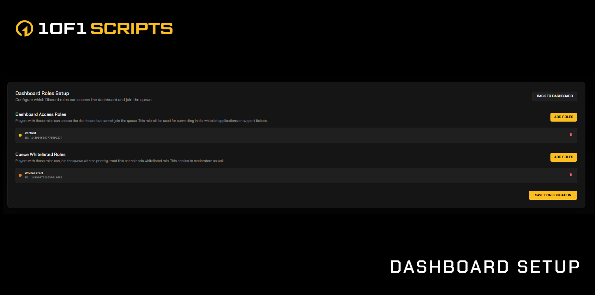

# Web Queue


Cfx Encryption Bypass

If you are considering leaking this resource or trying to gain
&#x20;access to it without purchasing, don't even bother. Access to
&#x20;our customer portal is restricted to verified buyers only.
&#x20;

After purchasing through Tebex, you are automatically assigned
&#x20;a role in our Discord, and only then are you able to set up
&#x20;and use the queue system. :joy:


<figure><figcaption></figcaption></figure>

## Web Queue

### Fully Standalone Web Queue System for FiveM & RedM

The **1of1 Scripts Web Queue** is a complete player queue, community management, and automation system designed for serious FiveM and RedM servers. It is fully standalone, requires no framework, and provides a robust ecosystem for players, staff, and administrators.

***

## Features Overview

### Fully Standalone

* No framework required
* Works with both FiveM and RedM

***

## Player Queue Interface

### Connection & Status Display

* **Live Connection Indicator** showing real-time server connectivity
* **Welcome Header** displaying the player's username and queue status prompt
* **Server Status Panel** for connection health and readiness

### Queue Overview Panel

* **Live Queue Count** showing real-time queue population
* **Queue Status Messages**, including:
  * You are not in queue
  * Authorized to Join
  * You are in queue
* **Priority Points Display** showing calculated player priority based on roles and tiers

### Join & Leave Queue System

* **Join Queue Button** with eligibility checks
* **Leave Queue Button** allowing instant queue exit
* **Role-Based Access Control** restricting queue access based on Discord roles

### Authorized to Join Mode

* **Join Window Countdown** (configurable timer before slot passes to next player)
* **Priority Confirmation** displaying priority values used for authorization
* **Highlighted Banner** for join notifications

### Active Queue Mode

* **Queue Position Tracking** updated in real time
* **Priority Influence Display** showing how priority affects ordering
* **Live Updating Interface** without refreshes

<figure><figcaption></figcaption></figure>

<figure><figcaption></figcaption></figure>

***

## FiveM API Configuration

### Integrated API Panel

* Direct connection to FiveM API endpoints
* Display of API URL, API key, and connection status
* **Secure API Key Authentication**

### Status Indicators

* Real-time API health verification
* Full compatibility with queue logic, authentication, and external integrations

<figure><figcaption></figcaption></figure>

***

## Discord Bot Setup

### Custom Bot Integration

* Use your own Discord bot
* Full ownership and compliance
* No shared or global bot

### Bot Configuration Overview

* Encrypted token storage
* Guild ID and settings shown in a single overview

### Discord Integration Features

* Role syncing
* Queue priority roles
* Application approvals
* Authentication
* Real-time secure events

<figure><figcaption></figcaption></figure>

***

## Advanced Ticket Support System

### Ticket Dashboard

* Search, filter, and sort tickets
* Clean, modern layout with detailed metadata

### Search & Filtering

* Filter by status, priority, and department
* Search by title, ID, or keyword

### Ticket Creation

* Create tickets with title, department, priority, description, and file attachments

### Ticket Details View

* Full metadata, timestamps, and ticket actions
* **Reply System** with text and file uploads
* **Status Management** (Open, In Progress, Resolved, Closed)

<figure><figcaption></figcaption></figure>

<figure><figcaption></figcaption></figure>

<figure><figcaption></figcaption></figure>

***

## Application Management System

### Application Dashboard

* View and manage all applications
* Includes titles, created dates, and statuses

### Create Application Modal

* Title and description
* Multiple submissions toggle
* Role assignment upon approval

### Custom Question Builder

* Unlimited questions
* Short text
* Long text
* Single choice
* Multiple choice
* Reorder, edit, or delete questions

### Role Assignment

* Automatically assign Discord roles on approval

<figure><figcaption></figcaption></figure>

<figure><figcaption></figcaption></figure>

<figure><figcaption></figcaption></figure>

<figure><figcaption></figcaption></figure>

***

## Dashboard Role Configuration

### Dashboard Access Roles

* Define who can access the dashboard
* Used for staff, whitelist reviewers, and admins

### Queue Whitelisted Roles

* Restrict queue access to designated community roles

<figure><figcaption></figcaption></figure>

***

## Priority Roles Setup

### Drag-and-Drop Priority Tiers

* Easily reorder priority groups
* Auto-updating priority levels

### Configured Roles Overview

* Display of role names, IDs, and priority values

### Priority Logic

* Priority tiers directly impact queue ordering
* Roles stack for priority.&#x20;

<figure><figcaption></figcaption></figure>

***

## Moderators System

### Moderator Dashboard

* View all moderators and permissions
* Includes user ID or role ID based permissions

### Add Moderator Modal

* Add by Discord user ID or role ID
* Granular access for tickets, apps, or both
* Full editing and removal controls

<figure><figcaption></figcaption></figure>

***

## Landing Page Configuration

### Navigation Bar

* Custom logo uploads (PNG, JPG, SVG, GIF, WebP)
* Optional store link (Tebex or custom URL)

### Hero Section

* Optional banner image
* Custom title and description

### Main Website Link

* Optional website button
* Upload a main image for branding

### Page Details / Metadata

* Meta description (up to 500 characters)
* Page title (up to 200 characters)
* Favicon upload with preview

### Quick Links

* Add Discord, store, rules, homepage, and more
* Drag-and-drop ordering
* Unlimited custom links

<figure><figcaption></figcaption></figure>

<figure><figcaption></figcaption></figure>

<figure><figcaption></figcaption></figure>

<figure><figcaption></figcaption></figure>

<figure><figcaption></figcaption></figure>

***

## Custom Domain Configuration

### Full Custom Domain Support

* Replace your queue URL with your own domain
* Supports root domains and subdomains

### Domain Overview

* Validation status
* DNS instructions
* SSL certificate status

### Cloudflare SSL Automation

* SSL issued automatically after DNS verification
* No manual certificate work required

### Streamlined Setup

* Add required TXT and CNAME records
* System handles validation and activation

<figure><figcaption></figcaption></figure>

***
