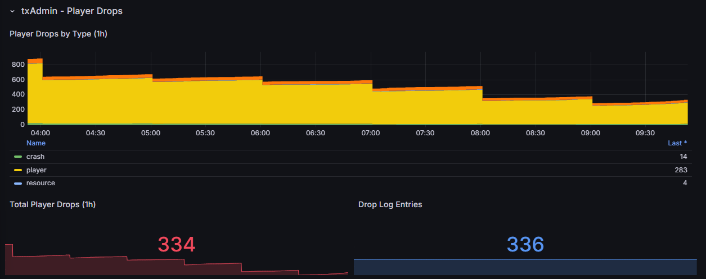

# txAdmin - Player Drops (1h window)

### txAdmin - Player Drops (1h window)

| Metric                                | Description                   |
| ------------------------------------- | ----------------------------- |
| `scripts_1of1_tx_server_info`         | Server version info (labeled) |
| `scripts_1of1_tx_resource_list_count` | Resources in txAdmin list     |
| `scripts_1of1_tx_drop_log_hours`      | Hourly drop log entries       |
| `scripts_1of1_tx_drops_by_type`       | Drops by type (labeled)       |
| `scripts_1of1_tx_crashes_by_type`     | Crashes by reason (labeled)   |
| `scripts_1of1_tx_resource_kicks`      | Kicks by resource (labeled)   |
| `scripts_1of1_tx_drops_total`         | Total drops (1h)              |

<figure><figcaption></figcaption></figure>

<figure><figcaption></figcaption></figure>
