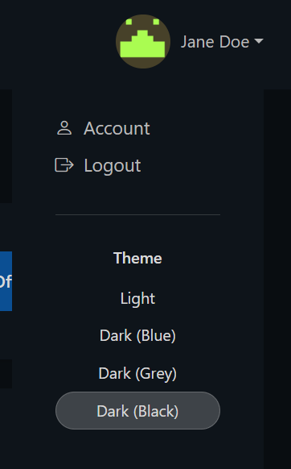

# Customer Area

## VPS Dashboard

Welcome to your [VPS Dashboard](https://dashboard.1of1servers.com/dashboard)!

The 1Of1 VPS Server Dashboard provides you with a broad view of your account's activity and information, it displays:&#x20;

* All your Recent & Bookmarked Servers
* Basic account information:
  * Account email, last login, account timezone, and two-factor authentication status (On/Off)
* Notifications
* Traffic Consumption
* Recently Completed Tasks


First Things First!

* Take care of your eyes and select your favourite theme!
* Enable Two Factor Authentication


<figure><figcaption>
Theme Selection
</figcaption></figure>


Each of your services will have its very own dashboard to uniquely tailor your settings to that server's needs.&#x20;

To manage a particular Server, locate it on the list of Recent Servers and click "**Manage**"


<figure><figcaption></figcaption></figure>

**Your VPS Server Dashboard will display**:&#x20;

* The "Overview" tab is a bird's eye view of the core principles of your VPS settings. This broad overview is then segmented into tabs that provide more in-depth info and settings catering to that section.&#x20;
  * The core information is as follows:
    * Statistics, recently completed tasks, memory/CPU usage, your VPS specs, and the Server's power settings.
  * The other tabs include:
    * Network, Storage, Backups, Media, and overall settings in Options.

<figure><figcaption>
Server Dashboard
</figcaption></figure>
