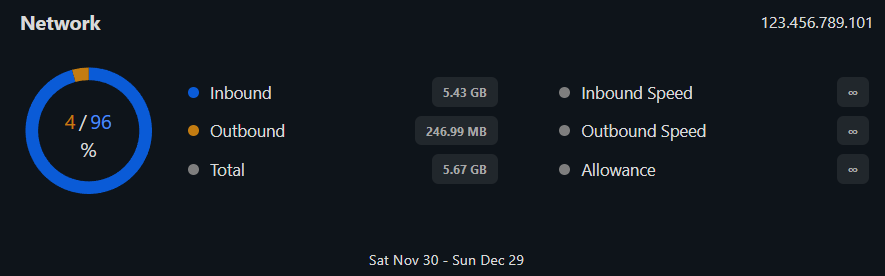

# Server Management

## Overview

Let's take a look at what you can do in the Overview tab!

#### Server Name/Hostname Change

* Click the settings wheel just below the "Overview" tab, change your desired name(s), then click "**Save**"

<figure><figcaption>
Name Change Settings Cog
</figcaption></figure>


This example shows a VPS Server that did not have a Hostname chosen when it was initially built

ScarletteFox -> ScarletteFox1


<figure><figcaption>
Name Change
</figcaption></figure>

### Statistics

#### Memory & CPU Usage

* Displays your active Memory (RAM) & CPU usages

<figure><figcaption>
RAM &#x26; CPU Usages
</figcaption></figure>

(Under the Statistics dropdown button)

<figure><figcaption>
Memory Graph
</figcaption></figure>

<figure><figcaption>
CPU Graph
</figcaption></figure>

#### Network Traffic & Server Information

* Displays monthly traffic statistics (Inbound/Outbound, Total, Allowance, & Speed)
  * We offer **unlimited traffic**! But it's always cool to see more of your stats
* Shows your server information such as; the date and time it was created, its system ID, primary IP, loader, RAM specs and server location.

<figure><figcaption>
Network Traffic
</figcaption></figure>

<figure><figcaption>
Server Info
</figcaption></figure>

(Under the Statistics dropdown button)

<figure><figcaption></figcaption></figure>

#### Server Power Options

* You are able to:
  * Shutdown
  * Power Off
  * Restart
  * Rebuild


DO NOT TOUCH THE BIG RED BUTTON UNLESS TOLD TO OR NECESSARY.


<figure><figcaption>
Server Power Options
</figcaption></figure>

#### Protect Server

* Enabling protection saves you from the consequences of the big red button (Rebuild, see above) being clicked by accident and accidentally rebuild your server!
  * Click the padlock just below the "Overview" tab and when prompted click "**Protect**"


We recommend turning this on until otherwise told to click on Big Red! (Rebuild)


<figure><figcaption>
Protect Server Padlock
</figcaption></figure>

<figure><figcaption></figcaption></figure>

<figure><figcaption>
Protect Server Enabled
</figcaption></figure>

#### Rebuild (the Big Red Button)


If you choose to proceed and click "**Rebuild**", it will <mark style="color:red;">**DELETE ALL SERVER DATA!!**</mark>

